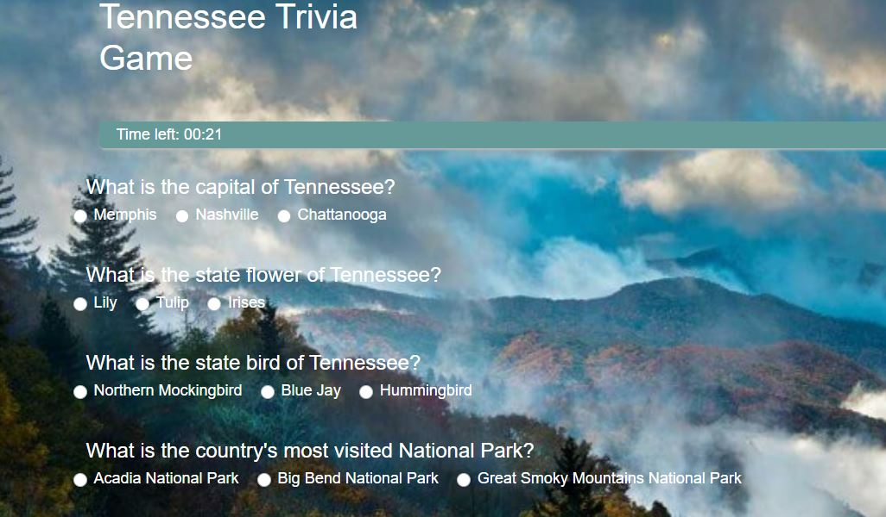

# Tennessee Trivia Game

## Description
JavaScript timing functions used in everyday applications such as a mobile phone alarm clock or the countdown timer on your microwave, are utilized to build a JavaScript program to execute functionality. With the creation of the Tennessee Trivia Game JavaScript was used for the logic and jQuery needed to manipulate the HTML.
